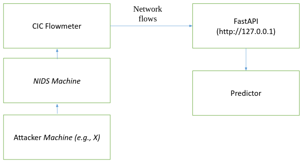

Deployment of a Network Intrusion Detection System based on a sophisticated deep learning architecuture, called Jet-like architecture.
## References
<a href="https://arxiv.org/abs/2002.12592">Original Paper</a>

## Architecture

## Attack detection flow

